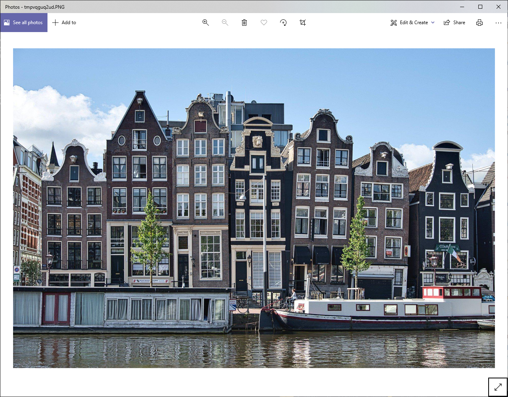

## Các thao tác trên hình ảnh cơ bản với thư viện Pillow

[Python Pillow](https://python-pillow.org/) là 1 bản fork từ một thư viện cũ hơn tên PIL(Python Imaging Library). Cách cài đặt như sau:

```bash
python -m venv venv
.\venv\Scripts\active
python -m pip install Pillow
```

Sau khi cài đặt thành công, bạn đã sẵn sàng để tiến hành làm quen với Pillow và thực viện các thao tác cơ bản lên hình ảnh!

---

### *Image* module và *Image* Class trong Pillow

Lớp cơ bản được định nghĩa trong Pillow là **Image**. Khi bạn đọc hình ảnh sử dụng Pillow thì hình ảnh được lưu trữ dưới dạng **Image** object.

Chúng ta sẽ sử dụng REPL để thao tác thuận tiện nhất trong quá trình khám phá thư viện này:

```python
>>> from PIL import Image
>>> filename = "image.jpg"
>>> with Image.open(filename) as img:
...     img.load()
...     

>>> type(img)
<class 'PIL.JpegImagePlugin.JpegImageFile'>

>>> isinstance(img, Image.Image)
True
```

Tất nhiên bạn có thể import Pillow thay vì PIL. Tuy nhiên Pillow là 1 bản fork của PIL nên bạn vẫn phải dùng PIL khi import vào code.

Gọi hàm `open()` để đọc hình ảnh từ file và `.load()` để load hình ảnh vào bộ nhớ, từ đó file có thể closed. Sử dụng `with` để tạo context manager để chắc chắn rằng file sẽ được đóng khi mà không còn dùng tới nữa.

Bạn có thể hiển thị hình ảnh bằng lệnh `.show()`

```python
>>> img.show()
```

`.show()` lưu hình ảnh ở tệp tạm và hiển thị chúng ở phần mềm quản lí ảnh mặc định của hệ điều hành mà bạn đang sử dụng. Khi chạy đoạn code trên, bạn sẽ thấy hình ảnh như sau được hiển thị:

Ngoài ra, còn các phương thức khác để tìm thông tin của ảnh như `.format`, `.size` và `.mode`:

```python
>>> img.format
'JPEG'

>>> img.size
(1920, 1273)

>>> img.mode
'RGB'
```

Thông thường, bạn cần cắt và resize lại ảnh thì **Image** class có sẵn 2 phương thức cho bạn `.crop()` và `.resize()`:

```python
>>> cropped_img = img.crop((300, 150, 700, 1000))
>>> cropped_img.size
(400, 850)

>>> cropped_img.show()

>>> low_res_img = cropped_img.resize(
...     (cropped_img.width // 4, cropped_img.height // 4)
... )

>>> low_res_img.show()
```

Tham số của `.crop()` là 4-tuple định nghĩa toạ độ của (left, upper, right, bottom) mà bạn mong muốn crop. Hệ toạ độ được sử dụng trong Pillow quy định toạ độ (0, 0) là pixel trên cùng bên trái của ảnh. Đây cũng là hệ toạ độ thường được sử dụng trong mảng 2 chiều (two-dimensional arrays).


Kết quả thu được từ method `.crop()` ở trên là 1 ảnh với size `400x850` pixels.
Bức ảnh sau khi cắt chỉ hiển thị 1 toà nhà từ ảnh gốc :D


Trong đoạn code trên, bạn cũng có thể thay đổi độ phân giải của ảnh sử dụng `.resize()`, với tham số là 1 tuple định nghĩa heigth và width mới cho ảnh với đơn vị pixels.

Ở ví dụ trên, chúng ta đã tạo 1 ảnh mới với chiều dài, chiều cao bằng 1/4 lần ảnh gốc sử dụng toán tử **floor devision (//)**


Sau khi đã hoàn thành các thao tác bạn muốn, bạn có thể lưu ảnh sử dụng:

```python
>>> cropped_img.save("cropped_image.jpg")
```

Một khi method `.save()` được gọi, nó sẽ tạo ra 1 ảnh mới từ **Image** object ở trong thư mục làm việc của bạn. Phần mở rộng của file (PNG/JPG) có thể được tự động detect hoặc do bạn định nghĩa ở trong phần tham số mở rộng (optional argument)

---

### Thao tác cơ bản trên ảnh

Bạn có thể thực hiện các thao tác cắt, resize cũng như xoay hoặc lật ảnh. Ngoài ra bạn còn có thể sử dụng `.transpose()` method để *transform* ảnh.

```python
>>> converted_img = img.transpose(Transpose.FLIP_TOP_BOTTOM)
>>> converted_img.show()
```

Có tất cả 7 options mà bạn có thể truyền vào như 1 tham số của `.transpose()`:

- **Transpose.FLIP_LEFT_RIGHT**: Lật ảnh từ trái sang phải.
- **Transpose.FLIP_TOP_B**OTTOM: Lật ảnh từ trên xuống dưới.
- **Transpose.ROTATE_90:** Xoay ảnh 90 độ ngược chiều kim đồng hồ.
- **Transpose.ROTATE_180**: Xoay ảnh 180 độ.
- **Transpose.ROTATE_270**: Xoay ảnh 270 độ ngược chiều kim đồng hồ (90 độ theo chiều kim đồng hồ).
- **Transpose.TRANSPOSE:** Chuyển đổi các hàng và cột bằng cách sử dụng pixel trên cùng bên trái làm điểm gốc, với pixel trên cùng bên trái trong hình ảnh được chuyển vị giống như trong hình ảnh gốc.
- **Transpose.TRANSVERSE**: Chuyển đổi các hàng và cột bằng cách sử dụng pixel dưới cùng bên trái làm điểm gốc, với pixel dưới cùng bên trái là pixel vẫn cố định giữa phiên bản gốc và phiên bản đã sửa đổi.

Tất cả các phép xoay trên đều được định nghĩa với bước xoay là bội của 90. Nếu bạn cần xoay với một góc khác, bạn có thể dùng `.rotate()`:

```python
>>> rotated_img = img.rotate(45)
```

**Image** object được trả về có size tương tự với **Image** gốc. Tuy nhiên, góc của ảnh bị khuyết mất khi hiển thị, bạn có thể thay đổi bằng cách thêm parameter `expand`:

```python
>>> rotated_img = img.rotate(45, expand=True)
>>> rotated_img.show()
```


---

### Các chế độ và dải màu của ảnh trong Pillow

Hình ảnh là một mảng 2 chiều các pixels, trong đó mỗi pixel tương ứng với 1 màu, được biểu diễn bởi 1 hoặc nhiều giá trị. Ví dụ, với 1 bức ảnh RBG, mỗi pixel được biểu diễn bới 3 giá trị đỏ, xanh lục và xanh dương cho pixel đó.

Vì vậy, **Image** object biểu diễn cho ảnh RBG sẽ bao gồm 3 dải biểu diễn cho mỗi màu. Ảnh RBG `100x100` pixels sẽ được biểu diễn dưới dạng ma trận `100x100x3`.

Bạn có thể tìm được có tất cả bao nhiêu dải màu trong ảnh sử dụng `.getbands()`, và chuyển đổi giữa các modes (RGB, RGBA, ...) bằng `.convert()`


Mode của ảnh quả dâu trên đây là RGB. Bạn có thể chuyển đổi về các mode khác bằng cách sau:

```python
>>> file_name = "strawberry.jpg"
>>> with Image.open(file_name) as img:
...     img.load()
...

>>> cmyk = img.convert("CMYK")
>>> gray_img = img.convert("L")  # Grayscale

>>> cmyk_img.show()
>>> gray_img.show()

>>> img.getbands()
('R', 'G', 'B')
>>> cmyk_img.getbands()
('C', 'M', 'Y', 'K')
>>> gray_img.getbands()
('L',)
```

Ở phía trên, chúng ta gọi `.convert()` 2 lần để chuyển đổi ảnh RGB về ảnh CMYK và ảnh xám. Ảnh CMYK nhìn bằng mắt thường thì tương tự như ảnh gốc, nhưng được mã hoá (encoded) sử dụng mode phù hợp và phổ biến với việc in ấn hơn là hiển thị trên màn hình. Kết quả khi chuyển đổi sang ảnh xám sẽ như sau:


Kết quả sau khi gọi `.getbands()` xác minh rằng có 3 dải màu trong ảnh RGB, 4 dải trong ảnh CMYK và 1 dải trong ảnh xám (grayscale).

Bạn cũng hoàn toàn có thể tách ảnh ra thành các dải màu sử dụng `.split()` và gộp chúng trở lại bằng `.merge()`

---

## Xử lý ảnh sử dụng Pillow

Ở các ví dụ trên, bạn đã biết cách làm sao để cắt, xoay. resize và tách màu ra từ ảnh. Tuy nhiên không có cái nào trong số chúng là làm việc thật sự trên các đối tượng trong ảnh. Cho nên, ở phần này, bạn sẽ biết được làm sao để tiến hành xử lý ảnh sử dụng thư viện Pillow cũng như **ImageFilter** (bộ lọc ảnh) module của Pillow

### Bộ lọc ảnh sử dụng Tích chập (Convolution Kernels)

Một trong những phương pháp được sử dụng trong việc xử lý ảnh là tích chập sử dụng các Kernels (hạt nhân?).


Bạn có thể xem ví du dưới đây để có thể hiểu hơn về việc tích chập trên ảnh sử dụng kernels. Ảnh ví dụ có size `30x30` pixels, chứa 1 dấu chấm và một đường thẳng dọc. Đường thẳng rộng 4 pixels, và dấu chấm là 1 hình vuông cạnh 4 pixels:


Bạn có thể đặt mặt nạ (kernels) này tại bất kì vị trí nào của ảnh và dùng vùng trung tâm của nó như một tham chiếu để tính toán:


Trong đó:

- **Ô màu trắng**: biểu diễn cho pixels của ảnh mà có giá trị bằng 0.
- **Ô màu đỏ**: biểu diễn cho pixels của ảnh mà có giá trị bằng 255.
- Mỗi **ô màu tím**: Biểu diễn cho mặt nạ (kernels). Mặt nạ được dùng trong ví dụ là 1 ma trận `3x3` với mỗi ô có giá trị 1/9.

Các bước thực hiện để cho ra ảnh kết quả khi sử dụng mặt nạ này có thể tóm tắt như sau:

1. **Đặt mặt nạ**: Tuỳ thuộc vào vị trí mà bạn đặt mặt nạ, vùng tính toán sẽ là những pixels của ảnh được cover bởi 9 ô của mặt nạ.
2. **Nhân giá trị của mặt nạ và ảnh**: Nhân các giá trị trong mỗi ô trong mặt nạ với các giá trị pixel tương ứng trong hình ảnh. Bạn sẽ thu được chín giá trị từ chín phép nhân trên.
3. **Tính tổng các giá trị thu được trước đó**: Cộng 9 giá trị trên. Kết quả sẽ là giá trị của pixel trung tâm của ảnh mới (cùng toạ độ với pixel trung tâm của mặt nạ).
4. **Thực hiện tương tự cho các pixel khác.**

Kết quả thu được của việc thực hiện tích chập là ảnh bên phía tay phải, còn ảnh gốc được thể hiện ở phía tay trái:


Mặt nạ được sử dụng ở ví dụ trên được gọi là [Box blur kernel](https://en.wikipedia.org/wiki/Box_blur). Thư viện Pillow cung cấp nhiều mặt nạ khác (built-in kernels) cũng như các phương thức để thực hiện tích chập như trên.

### Làm mờ ảnh, sắc nét ảnh và làm mịn hình ảnh

Các bước chuẩn bị như sau:

```python
>>> from PIL import Image, ImageFilter
>>> file_name = "buildings.jpg"
>>> with Image.open(file_name) as img:
...     img.load()
...
```

Bạn có thể làm mờ ảnh sử dụng bộ lọc được định nghĩa sẵn từ Pillow:

```python
>>> blur_img = img.filter(ImageFilter.BLUR)
>>> blur_img.show()
```

Ảnh kết quả hiện ra sẽ được làm mờ từ ảnh gốc. Bạn cũng có thể zoom vào một vùng cố định để quan sát kĩ hơn:

```python
>>> img.crop((300, 300, 500, 500)).show()
>>> blur_img.crop((300, 300, 500, 500)).show()
```


Bạn cũng có thể customize lại cách làm mờ cũng như mức độ mờ của ảnh bằng `ImageFilter.BoxBlur()` hoặc `ImageFilter.GaussianBlur()`:

```python
>>> img.filter(ImageFilter.BoxBlur(5)).show()
>>> img.filter(ImageFilter.BoxBlur(20)).show()
>>> img.filter(ImageFilter.GaussianBlur(20)).show()
```

Kết quả sẽ được hiển thị như sau:


Bộ lọc `.GaussianBlur()` được xây dựng dựa trên [Gaussian Blur Kernel](https://en.wikipedia.org/wiki/Gaussian_blur). Phương pháp này đặt trọng số (weight) lên pixel trung tâm nhiều hơn là ở các cạnh. Chính vì vậy làm ảnh mượt hơn so với Box blur và được sử dụng phổ biến hơn trong nhiều trường hợp khác nhau khi làm mờ ảnh.

Vậy nếu như bạn muốn làm sắt nét hình ảnh của mình thì sao? Pillow cung cấp `Image.SHARPEN`:

```python
>>> sharp_img = img.filter(ImageFilter.SHARPEN)
>>> img.crop((300, 300, 500, 500)).show()
>>> sharp_img.crop((300, 300, 500, 500)).show()
```

Bạn có thể so sánh với ảnh gốc bên trái, ảnh được làm sắt nét bên phải để đưa ra nhận xét của bản thân:


Tương tự với việc làm mịn ảnh:

```python
>>> smooth_img = img.filter(ImageFilter.SMOOTH)
>>> img.crop((300, 300, 500, 500)).show()
>>> smooth_img.crop((300, 300, 500, 500)).show()
```


---

### Phát hiện, tăng cường góc cạnh của ảnh (Edge Detection, Edge Enhancement, and Embossing)

**ImageFilter** module trong Pillow có các mặt nạ được định nghĩa sẵn để thực hiện việc này. Chúng ta sẽ thực hiện việc này bằng cách sử dụng bức ảnh building ở trên và chuyển đổi về dạng ảnh xám trước khi áp dụng bộ lọc xác định cạnh (Edge detection):

```python
>>> img_gray = img.convert("L")
>>> edges = img_gray.filter(ImageFilter.FIND_EDGES)
>>> edges.show()
```


Bộ lọc này xác định cũng như làm rõ lên các góc cạnh trong ảnh. Bạn có thể sử dụng `ImageFilter.SMOOTH` trước khi tìm cạnh để có thể thu được kết quả tốt hơn:

```python
>>> img_gray_smooth = img_gray.filter(ImageFilter.SMOOTH)
>>> edges_smooth = img_gray_smooth.filter(ImageFilter.FIND_EDGES)
>>> edges_smooth.show()
```

Bạn có thể xem so sánh hình ảnh thang độ xám ban đầu và kết quả phát hiện hai cạnh bên dưới. Phiên bản làm mịn trước khi phát hiện cạnh được hiển thị ở dưới cùng:


Tiếp đến, `ImageFilter.EDGE_ENHANCE` sẽ giúp làm sắt nét các góc cạnh của ảnh kết quả:

```python
>>> edge_enhance = img_gray_smooth.filter(ImageFilter.EDGE_ENHANCE)
>>> edge_enhance.show()
```

Bạn đã sử dụng phiên bản làm mịn của hình ảnh thang độ xám để nâng cao các cạnh. Một phần của hình ảnh thang độ xám ban đầu và hình ảnh có các cạnh được nâng cao được hiển thị cạnh nhau bên dưới. Hình ảnh đã được làm sắt nét góc cạnh nằm ở bên phải:


Ngoài ra bạn có thể tìm hiểu thêm về các bộ lọc khác tại [`ImageFilter` documentation](https://pillow.readthedocs.io/en/stable/reference/ImageFilter.html?highlight=imagefilter#imagefilter-module)

(Còn tiếp)

Lược dịch từ [RealPython](https://realpython.com/image-processing-with-the-python-pillow-library/) phục vụ cho việc học tập của mình!
