## LÝ THUYẾT

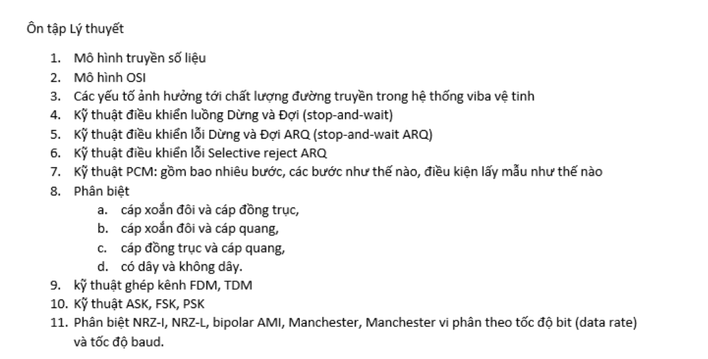

### Mô hình truyền số liệu

---

### Mô hình OSI

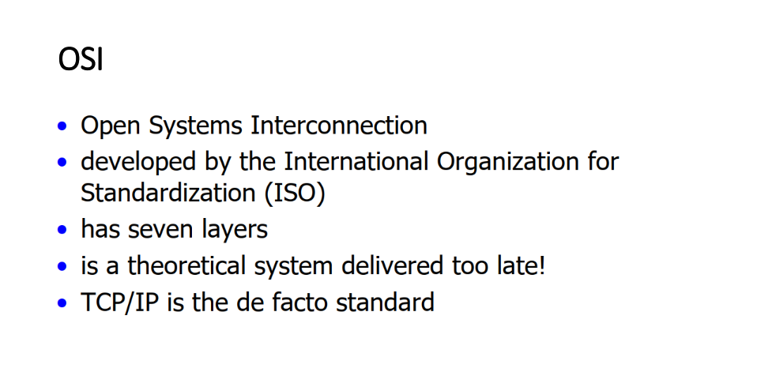

- Là viết tắt của **Kết nối các hệ thống mở** (Open Systems Interconnection).
- Phát triển bởi International Organization for Standardization (ISO).
- Có **7 tầng**:

    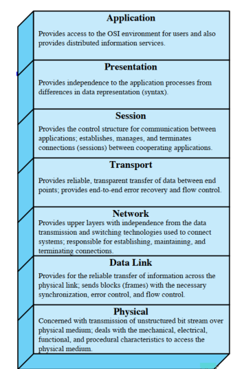

  - **Tầng vật lý (Physical Layer)**:
    Tầng vật lý định nghĩa tất cả các đặc tả về điện và vật lý cho các thiết bị. Trong đó bao gồm bố trí của các chân cắm (pin), các hiệu điện thế, và các đặc tả về cáp nối (cable). Các thiết bị tầng vật lý bao gồm Hub, bộ lặp (repeater), thiết bị chuyển đổi tín hiệu (converter), ...

    Chức năng và dịch vụ căn bản được thực hiện bởi tầng vật lý bao gồm:
    - Thiết lập hoặc ngắt mạch kết nối điện (electrical connection) với một môi trường truyền dẫn phương tiện truyền thông (transmission medium).

    - Tham gia vào quy trình mà trong đó các tài nguyên truyền thông được chia sẻ hiệu quả giữa nhiều người dùng.

    - Điều chế (modulation), hoặc biến đổi giữa biểu diễn dữ liệu số (digital data) của các thiết bị người dùng và các tín hiệu tương ứng được truyền qua kênh truyền thông.

  - **Tầng liên kết dữ liệu (Data-Link Layer)**:

    Tầng liên kết dữ liệu cung cấp các phương tiện có tính chức năng và quy trình để truyền dữ liệu giữa các thực thể mạng (truy cập đường truyền, đưa dữ liệu vào mạng), phát hiện và có thể sửa chữa các lỗi trong tầng vật lý nếu có.

    Tầng liên kết dữ liệu chính là nơi các thiết bị chuyển mạch (switches) hoạt động. Kết nối chỉ được cung cấp giữa các nút mạng được nối với nhau trong nội bộ mạng.

  - **Tầng mạng (Network Layer)**:

    Tầng mạng cung cấp các chức năng và quy trình cho việc truyền các chuỗi dữ liệu có độ dài đa dạng, từ một nguồn tới một đích, thông qua một hoặc nhiều mạng, trong khi vẫn duy trì chất lượng dịch vụ (quality of service) mà tầng giao vận yêu cầu.

    Tầng mạng thực hiện chức năng định tuyến. Các thiết bị định tuyến (router) hoạt động tại tầng này.

  - **Tầng giao vận (Transport Layer)**:

    Tầng giao vận cung cấp dịch vụ chuyên dụng chuyển dữ liệu giữa các người dùng tại đầu cuối.

    Tầng này là nơi các thông điệp được chuyển sang thành các gói tin TCP hoặc UDP. Ở tầng 4 địa chỉ được đánh là address ports, thông qua address ports để phân biệt được ứng dụng trao đổi.

  - **Tầng phiên (Session layer)**:

    Tầng phiên kiểm soát các (phiên) hội thoại giữa các máy tính.

    Tầng này thiết lập, quản lý và kết thúc các kết nối giữa trình ứng dụng địa phương và trình ứng dụng ở xa. Tầng này còn hỗ trợ hoạt động song công (duplex) hoặc bán song công (half-duplex) hoặc đơn công (Simplex) và thiết lập các quy trình đánh dấu điểm hoàn thành (checkpointing).

  - **Tầng trình diễn (Presentation layer)**:

    - Dịch các mã ký tự từ ASCII sang EBCDIC.
    - Chuyển đổi dữ liệu, ví dụ từ số interger sang số dấu phảy động.
    - Nén dữ liệu để giảm lượng dữ liệu truyền trên mạng.
    - Mã hoá và giải mã dữ liệu để đảm bảo sự bảo mật trên mạng.

  - **Tầng ứng dụng (Application layer)**:

    Tầng ứng dụng là tầng gần với người sử dụng nhất. Nó cung cấp phương tiện cho người dùng truy nhập các thông tin và dữ liệu trên mạng thông qua chương trình ứng dụng.

---

### Các yếu tố ảnh hưởng đến chất lượng đường truyền trong hệ thống viba vệ tinh

Bao gồm:

- Môi trường truyền dẫn: khí hậu, thời tiết,...

- Địa hình: mặt đất, đồi núi, nhà cửa cây cố,...

- Suy hao trong môi trường lớn.

- Nguồn nhiễu trong thiên nhiên: phóng điện trong khí quyển, phát xạ của các hành tinh khác (khi thông tin vệ tinh),...

- Nhiễu công nghiệp từ các động cơ đánh lửa bằng tia lửa điện.

- Chịu ảnh hưởng nhiễu từ các thiết bị vô tuyến khác.

---

### Kỹ thuật điều khiển luồng Dừng và Đợi (stop-and-wait)

Là kỹ thuật điều khiển luồng đơn giản nhất.

Giả sử có 2 bên phát A và thu B, bên A muốn truyền dữ liệu sang bên B.

Bên A sẽ gửi 1 Frame tín hiệu sang B, nếu bên B có thể tiếp nhận được gói tin (chưa bị quá tải) thì bên B sẽ gửi lại tín hiệu ACK (acknowledgement) để xác nhận là đã nhận được gói tin, bên A nhận được xác nhận thì gửi tiếp, cứ thế mà truyền dần dần từng gói. Nếu bên B đang nhận quá nhiều thông tin (bên A gửi nhiều quá hoặc đơn giản nhiều bên khác gửi) thì bên B đơn giản là xử lý xong thông tin đã rồi mới gửi ACK -> không bị quá tải.

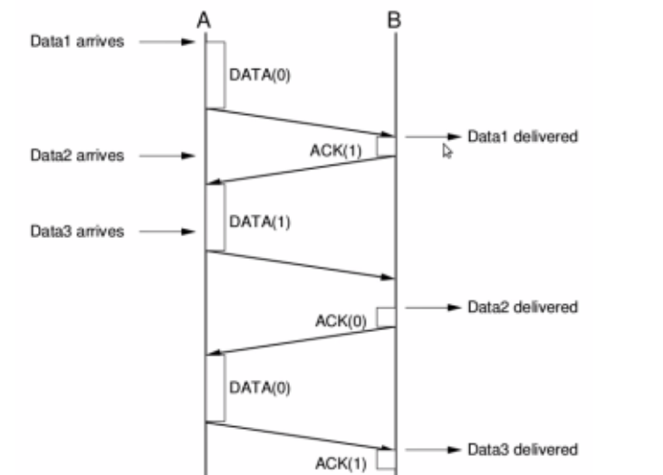

---

### Kỹ thuật điều khiển luồng Dừng và Đợi ARQ (stop-and-wait ARQ)

Là một phương pháp điều khiển lỗi dựa trên cơ chế điều khiển luồng dừng và đợi.
Giống như cơ chế dừng và đợi nhưng phản hồi về sẽ có 3 trường hợp:

- **ACK** : bản tin đã đến đích và gửi đúng, tiếp tục gửi dữ liệu.

- **NAK** : báo lỗi, gửi lại thông tin.

- **Không thấy gì** : xảy ra khi frame phát đi bị mất hoặc đến được nơi nhưng thông tin phản hồi bị mất khi truyền, bên gửi sẽ gửi lại sau 1 thời gian chờ (time out).

Đặc điểm: đơn giản và không hiệu quả.

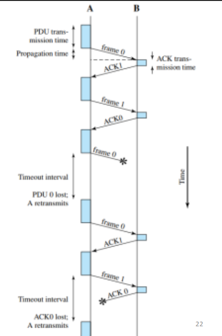

### Kỹ thuật điều khiển lỗi Selective reject ARQ

- Nếu có lỗi xảy ra, chỉ những gói lỗi được gửi (phát) lại.

- Cần có bộ nhớ đệm để sắp xếp lại các gói.

- Đặc điểm:

  - Hiệu suất cao hơn Go Back N ARQ.

  - Sử dụng đường truyền hiệu quả hơn.

  - Các khung tin đến hông theo thứ tự  =))).
  
  - Phức tạp, yêu cầu phải có bộ nhớ đệm.

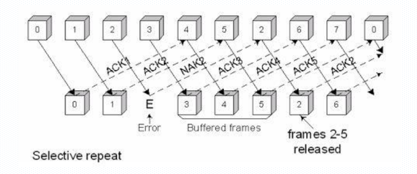

---

### Kỹ thuật PCM (Pulse Code Modulation)

Điều chế mã xung ( PCM ) là một phương pháp được sử dụng để biểu diễn kỹ thuật số các tín hiệu tương tự được lấy mẫu. Nó là hình thức tiêu chuẩn của âm thanh kỹ thuật số trong máy tính, đĩa compact, điện thoại kỹ thuật số và các ứng dụng âm thanh kỹ thuật số khác.

Bao gồm 3 bước xử lý:

- **Lấy mẫu (Sampling)**:
Lấy mẫu là một quá trình đo tín hiệu theo các khoảng bằng nhau trong đó tín hiệu thông điệp (dải cơ sở) được lấy mẫu với dòng xung hình chữ nhật.
Các xung này được thu hẹp cực kỳ chặt chẽ để trích xuất quy trình lấy mẫu tức thời.
Sự tái tạo chính xác của tín hiệu băng cơ sở thu được khi tốc độ lấy mẫu phải lớn hơn hai lần thành phần tần số cao nhất được gọi là tốc độ *Nyquist*.

- **Lượng tử hoá (Quantization)**:
Sau khi lấy mẫu tín hiệu thông báo trải qua lượng tử hóa cung cấp biểu diễn riêng biệt theo cả thời gian và biên độ.
Trong quá trình lượng tử hóa, các thể hiện được lấy mẫu là các giá trị tích phân được sắp xếp trong phạm vi cụ thể.

- **Mã hoá (Encoding)**:
Tín hiệu truyền được tạo ra mạnh hơn để chống nhiễu và nhiễu tín hiệu được lượng tử hóa bằng cách chuyển nó thành một dạng tín hiệu phù hợp hơn và bản dịch này được gọi là mã hóa.

**Điều kiện lấy mẫu**:
Sự tái tạo chính xác của tín hiệu băng cơ sở thu được khi tốc độ lấy mẫu phải lớn hơn hai lần thành phần tần số cao nhất `Fs =2*fh`

---

### Phân biệt, so sánh các loại cáp

- **Cáp đồng trục:**
Là một dây đơn thường được bọc trong một lớp cách nhiệt bằng bọt, được bao quanh đối xứng bởi một lá chắn kim loại bện, sau đó được bọc trong một chiếc áo khoác nhựa.
Do đặc tính cách điện của nó, cáp đồng trục có thể mang tín hiệu tương tự với dải tần số rộng.
Do đó, nó được sử dụng rộng rãi trong các đường truyền kết nối máy phát và máy thu radio với ăng ten, kết nối mạng máy tính, âm thanh kỹ thuật số và phân phối tín hiệu truyền hình cáp.

- **Cáp xoắn (cáp xoắn đôi)**:
Cáp xoắn đôi là một loại dây trong đó hai dây dẫn của một mạch đơn được xoắn với nhau. Nó có hai phiên bản: Cặp xoắn bảo vệ (STP) và Cặp xoắn không che chắn (UTP). STP thường được sử dụng trong các mạng Token Ring và UTP nằm trong các mạng Ethernet.

- **Cáp quang**:
Cáp quang là cáp chứa một hoặc nhiều sợi quang. Cáp quang thường chứa một số lõi silica và mỗi sợi có thể chứa nhiều bước sóng (hoặc kênh), cho phép sợi quang đáp ứng yêu cầu dung lượng dữ liệu ngày càng tăng.

*So sánh:*

- Cáp đồng trục có thể được cài đặt dễ dàng, tương đối chống nhiễu. Tuy nhiên, nó cồng kềnh và chỉ lý tưởng cho chiều dài ngắn vì độ suy giảm cao. Nó sẽ tốn kém khi truyền dữ liệu đường dài.
- Cáp xoắn đôi là linh hoạt nhất và rẻ nhất trong số ba loại cáp, dễ cài đặt và vận hành. Nhưng nó cũng gặp phải vấn đề suy giảm và cung cấp băng thông tương đối thấp. Ngoài ra, nó dễ bị nhiễu và tiếng ồn.
- Là một trong những phương tiện phổ biến nhất cho cả cài đặt và nâng cấp hệ thống cáp mới, bao gồm các ứng dụng xương sống, ngang và thậm chí cả máy tính để bàn, cáp quang có kích thước nhỏ và trọng lượng nhẹ. Bởi vì dây dẫn là thủy tinh có nghĩa là không có dòng điện nào có thể chạy qua, cáp quang miễn nhiễm với nhiễu điện từ. Ưu điểm lớn nhất của cáp quang là nó có thể truyền một lượng lớn dữ liệu với tổn thất thấp ở tốc độ cao trên quãng đường dài. Tuy nhiên, nó cần các kỹ năng cài đặt phức tạp, khó làm việc và tốn kém trong thời gian ngắn.

---

### Ghép kênh

#### FDM

**Ghép kênh phân chia tần số (FDM)** là một kỹ thuật tương tự chỉ được thực hiện khi băng thông của liên kết cao hơn băng thông hợp nhất của các tín hiệu được truyền. Mỗi thiết bị gửi tạo ra các tín hiệu điều chế ở tần số sóng mang khác nhau. Để giữ tín hiệu điều chế, tần số sóng mang được cách ly bởi băng thông thích hợp. Các tín hiệu điều chế sau đó được hợp nhất thành một tín hiệu ghép có thể được truyền bởi liên kết. Các tín hiệu truyền qua các dải băng thông được gọi là các kênh.

**Tín hiệu chồng chéo** có thể được kiểm soát bằng cách sử dụng các dải băng thông không sử dụng để phân tách các kênh, chúng được gọi là các dải bảo vệ . Ngoài ra, tần số sóng mang không được ngắt với tần số dữ liệu gốc. Nếu bất kỳ điều kiện nào không tuân thủ, các tín hiệu ban đầu không thể được phục hồi.

#### TDM

**Ghép kênh phân chia thời gian (TDM)** được coi là một quy trình kỹ thuật số có thể được sử dụng khi số lượng tốc độ dữ liệu trung bình truyền cao hơn mức yêu cầu tốc độ dữ liệu của các thiết bị truyền và nhận. Trong TDM, các khung tương ứng mang dữ liệu được truyền từ các nguồn khác nhau. Mỗi khung bao gồm một tập hợp các khe thời gian và các phần của mỗi nguồn được gán một khe thời gian cho mỗi khung.

Phân loại:

- Ghép kênh phân chia thời gian đồng bộ.
- Ghép kênh phân chia thời gian không đồng bộ

[Reference](https://vi.gadget-info.com/difference-between-tdm)

---

### Các kỹ thuật điều chế số

#### ASK

**Điều chế dịch biên ASK:**

- Trong điều chế ASK biên độ sóng mang hình sine tần số cao sẽ biến thiên theo mức luận lý của chuỗi tín hiệu số.Tổng quát tín hiệu số sẽ có m mức tín hiệu khác nhau.
- m=2 ta có điều chế dịch biên nhị phân BASK.

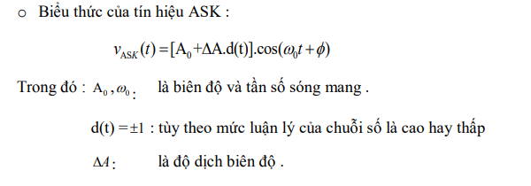

**Ưu điểm:**

- Chỉ dùng 1 sóng mang duy nhất.
- Phù hợp với truyền tốc độ thấp, dễ thực hiện.

**Nhược điểm:**

- Dễ bị ảnh hưởng bởi nhiễu.
- Khó đồng bộ, ít dùng trong thực tế.

Được ứng dụng trong cáp.

#### FSK

**Điều chế FSK (Fequency Shilf Keying):**

- Dùng 2 tần số khác nhau của sóng mang để biểu diễn bit 1 và 0.
- Tần số cao với mức 1 và thấp với mức 0.

**Ưu điểm:**

- Ít bị ảnh hưởng bởi nhiễu và ít lỗi hơn so với ASK.

**Nhược điểm:**

- Tần số cao dễ bị nhiễu và hạn chế tốc độ truyền.
- Khó đồng bộ.

**Ứng dụng:**

- Dùng rộng dãi trong truyền số liệu.
- Dùng để truyền dữ liệu tốc độ 1200bp hay thấp hơn trên mạng điện thoại.
- Có thể dùng tần số cao (3-30MHz) để truyền sóng radio hoặc cáp đồng trục.

#### PSK

**Điều chế dịch pha PSK( Phase Shilf Keying):**

- Pha của sóng mang hình sin tần số cao sẽ biến thiên theo mức logic 0 và 1 của chuỗi số.
- `M = 2^N` là số pha trạng thái khác nhau của sóng mang với N số bit nhị phân.Ta cóm các kiểu điều chế M-ary:BPSK, QPSK.

*BPSK:*

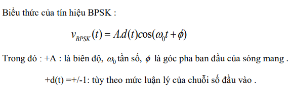

*QPSK:*

Là quá trình điều chế pha của sóng mang với 4 trạng thái khác nhau và vuông góc với nhau.

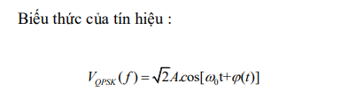

**Ưu điểm:**

- Ít lỗi, ít nhạy với nhiễu do pha ít bị ảnh hưởng của môi trường và tần số.

**Nhược điểm:**

- Khó thực hiện các mạch điều chế, dễ sai pha khi điều chế ở mức cao.

**Ứng dụng:**

- Sử dụng nhiều trong mạng không dây Wifi, di động CDMA.

---

## ÔN TẬP BÀI TẬP

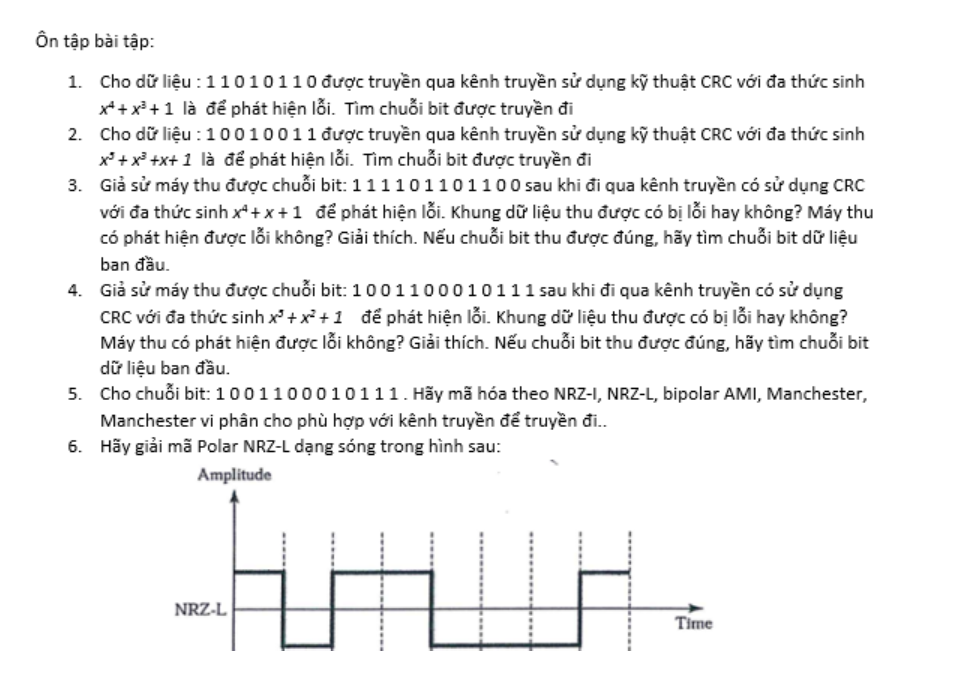

### Câu 1

I = `11010110`

G = `x4 + x3 + 1` = **11001**

Thêm (**length(G)** - 1 = 5 - 1 = 4) 4 bit `0` vào nguồn I, ta được P = `110101100000`

Chia đa thức P:G theo kiểu nhị phân.

```shell
 110101100000 | 11001
-11001        | 10010101
--------------
 000111
--------------
    1111
--------------
    11110
   -11001
--------------
    0011100    
     -11001
    ----------
      0010100
       -11001
    ----------
         1101 -> Phần dư R
```

=> Dãy bit được chuyển đi `D = P + R` = `110101100000 + 1101 = 110101101101`

### Câu 2

I = `10010011`

G = `x5 + x3 + x + 1` = **101011**

Thêm 5 bit `0` vào nguồn I, ta được P = `1001001100000`

Chia đa thức P:G theo kiểu nhị phân:

```shell
 1001001100000 | 101011
-101011        | 10110001
----------------
   111111
  -101011
----------------
    101000
   -101011
----------------
        110000
       -101011
    ------------
         11011 -> Phần dư R
```

=> Dãy bit được chuyển đi `D = P + R` = `1001001100000 + 11011 = 1001001111011`

Test:

```shell
 1001001111011 | 101011
-101011        | 10110001
-----------
   111111
  -101011
-----------
    101001
   -101011
---------------
        101011
       -101011
    -----------
             0    => Xác xuất cao là không có lỗi
```

### Câu 3

D = `111101101100`

G = `x4 + x + 1` = **10011**

Ta thực hiện phép chia D:G

```shell
 111101101100 | 10011
-10011        | 111000100
-----------
  11011
 -10011
-----------
   10001
  -10011
-----------
      10011
     -10011
     ------
      0000000 => Không có lỗi
```

Khung dữ liệu khả năng cao không có lỗi vì máy thu không phát hiện được lỗi (Kết quả số dư khi thực hiện phép `D:G = R = 0`)

Nếu chuỗi bit thu được đúng, ta có được chuỗi bit dữ liệu ban đầu như sau: `11110110`

### Câu 4

D = `1001100010111`

G = `x5 + x2 + 1` = **100101**

Ta thực hiện phép chia D:G

```shell
 1001100010111 | 100101
-100101        | 10001101
-----------
     110010
    -100101
    --------
      101111
     -100101
    ----------
        101011
       -100101
       ---------
          1110  => Dư R != 0
```

Khung dữ liệu có lỗi vì máy thu phát hiện được lỗi (kết quả số dư khi thực hiện phép `D:G = R != 0`).

### Câu 5

[Tham khảo](https://www.youtube.com/watch?v=i_TLLACZuRk)

Input: `1001100010111`

- **NRZ-I**:  Non Return to Zero Invert
  
  - Gặp bit cao `1` : Đảo chiều.
  
  - Gặp bit thấp `0`: Giữ nguyên.

    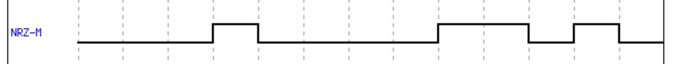

- **NRZ-L**: Non Return to Zelo Level
  
  - Gặp `0`: Vẽ cao.
  
  - Gặp `1`: Vẽ thấp.

    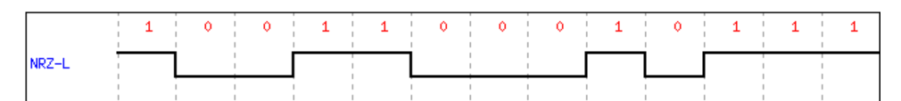

    **Hình sai chưa vẽ lại.**

- **bipolar AMI**:
  
  - `0`: Biểu diễn bởi đường thẳng.
  
  - `1`: Biểu diễn xoay chiều bởi 2 giá trị Dương (cực ao) hoặc Âm (cực thấp).

- **Manchester**:
  
  - `0`: Chuyển đổi từ mức **cao** sang **thấp** khi ở giữa khoảng thời gian xung (pulse interval).
  
  - `1`: Chuyển đổi từ mức **thấp** sang **cao** khi ở giữa khoảng thời gian xung.

- **Differential Manchester**: Luôn đổi chiều khi ở giữa khoảng thời gian xung.
  
  - `0`: Đổi chiều tại thời gian bắt đầu xung.
  
  - `1`: Không đổi chiều tại thời gian bắt đầu xung.
  
  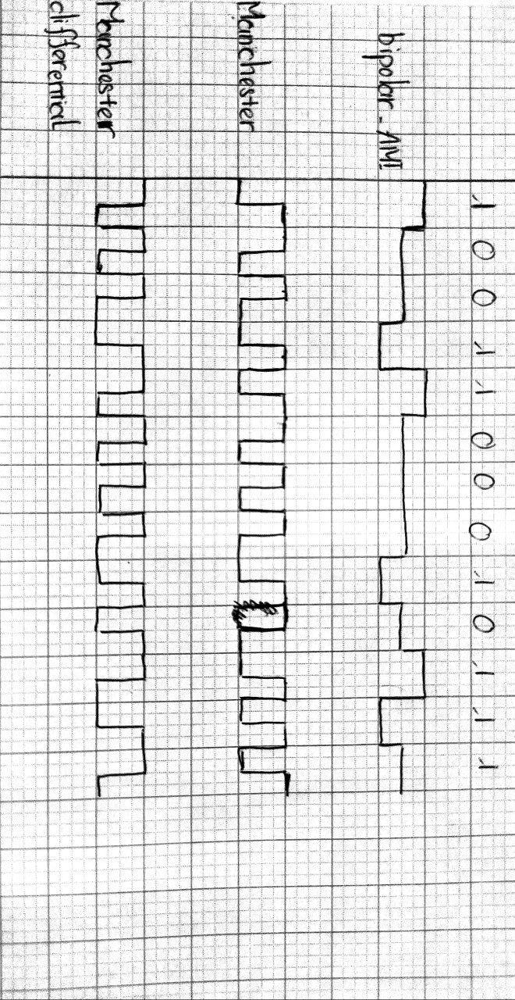

### Câu 6

Giải mã Polar NRZ-L dạng sóng hình như sau:

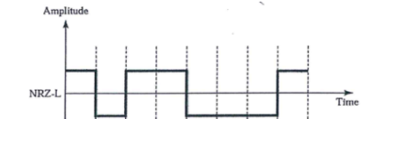

- `0`: Vẽ cao

- `1`: Vẽ thấp

=> `01001110`

**Note:** Update lý thuyết sau nếu rảnh 😅.
